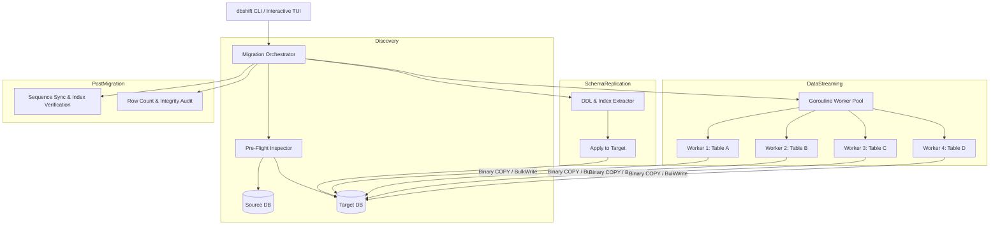

# dbshift Architecture Deep Dive

`dbshift` is engineered to solve large-scale cloud database migration with minimal memory overhead, zero data loss, and predictable throughput.

---

## High-Level Architecture



---

## Key Design Principles

### 1. Zero In-Memory Buffering (Constant RAM)
Instead of loading entire tables into RAM (`SELECT *` into memory slices), `dbshift` uses cursor-based streaming with fixed-size batch buffers:
- **Batch Chunking:** Rows are consumed in chunks (default `2,500` rows).
- **Fixed Memory Window:** RAM usage remains between **20 MB – 50 MB** regardless of whether migrating 10,000 rows or 100,000,000 rows.

### 2. High-Speed Wire Protocol
- **PostgreSQL / CockroachDB:** Uses Go's native `pgx/v5` binary `CopyFrom` protocol. This bypasses standard SQL string parsing on the database server and pipes records directly into table pages.
- **MongoDB Atlas:** Uses `BulkWrite` with `ordered: false` to allow MongoDB shards to ingest writes in parallel without waiting for sequential ACKs.

### 3. Concurrency & Goroutine Worker Pools
Tables are queued into a thread-safe Go channel. Configurable workers (`-c` flag, default `4`–`8`) pull tables and stream them concurrently, saturating the network pipe between the cloud clusters.

### 4. Sequence & Autoincrement Resynchronization
In PostgreSQL and CockroachDB, tables often utilize `SERIAL` or `BIGSERIAL` sequences. When records are copied directly with explicit primary key IDs, sequence counters can become stale. `dbshift` runs automated post-migration SQL fixups:
```sql
SELECT setval(pg_get_serial_sequence('table_name', 'id'), COALESCE(MAX(id), 1)) FROM table_name;
```

### 5. Data Integrity Verification Audit
After data transfer finishes, `dbshift` performs an automated audit comparing `COUNT(*)` across all migrated tables, displaying a verification summary matrix.
